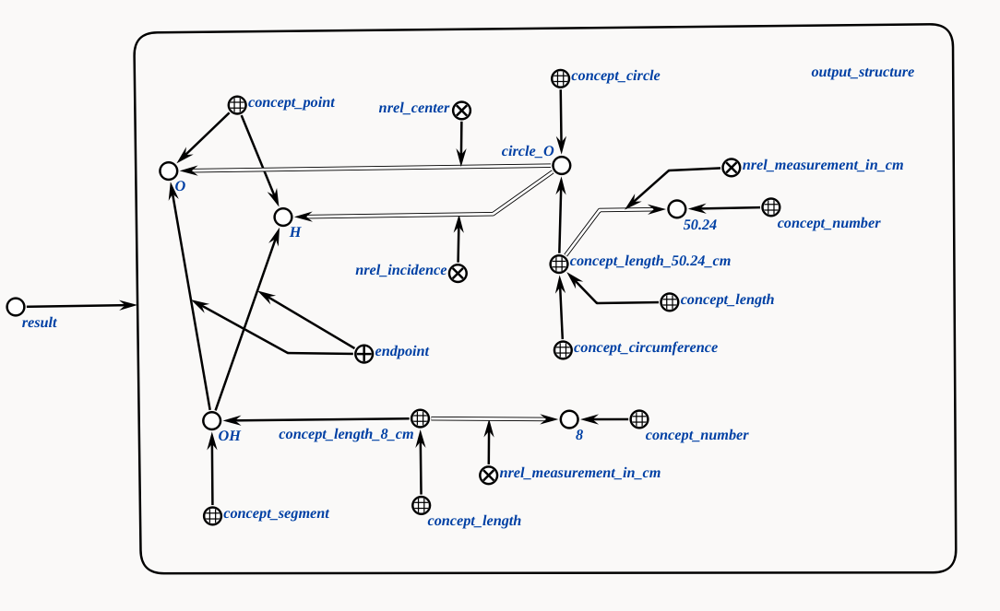
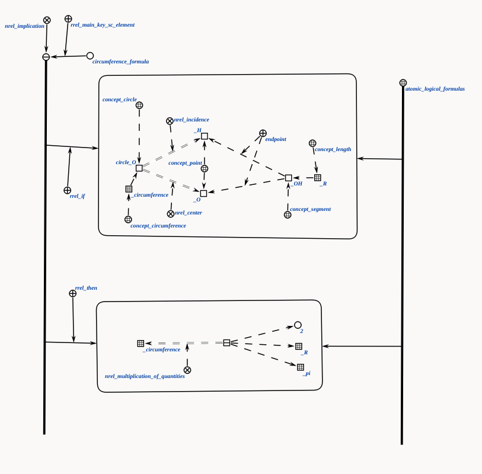

# Агент нахождения длины окружности

Это агент, который находит длину окружности, получая структуру окружность, как параметр.

**Класс действия:**

`action_find_circumference`

**Параметры:**

1. `circle_struct_addr` — sc-ссылка на структуру треугольника.

**Рабочий процесс:**

* Агент проверяет, являются ли равными стороны ab и ac, после чего вводит значение переменной _perimeter, вычисляя ее значение, путем суммы всех сторон треугольника.
 
### Пример

Пример входной структуры:

</img>

Пример выходной структуры:

</img>

### Логическое правило агента
</img>

### Результат

Возможные коды результата:
 
* `SC_RESULT_OK` — ответное сообщение сгенерировано;
* `SC_RESULT_ERROR` — внутренняя ошибка.
