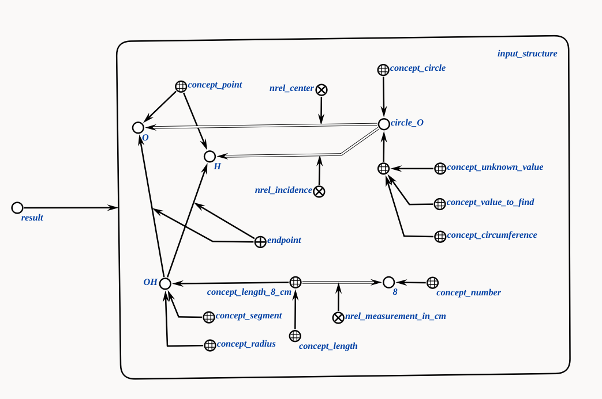

# Агент нахождения длины окружности

Это агент, который проверяет, является ли отрезок радиусом окружности, получая структуру окружность, как параметр.

**Класс действия:**

`action_generate_values_expressions`

**Параметры:**

1. `circle_struct_addr` — sc-ссылка на структуру окружности.

**Рабочий процесс:**

* Агент проверяет, лежит ли один конец отрезка `OH` в центре окружности, а второй конец на самой окружности и на основании этого делается вывод, является ли отрезок `OH` радиусом окружности.

### Пример

Пример входной структуры:

</img>

Пример выходной структуры:

</img>

### Результат

Возможные коды результата:
 
* `SC_RESULT_OK` — ответное сообщение сгенерировано;
* `SC_RESULT_ERROR` — внутренняя ошибка.
